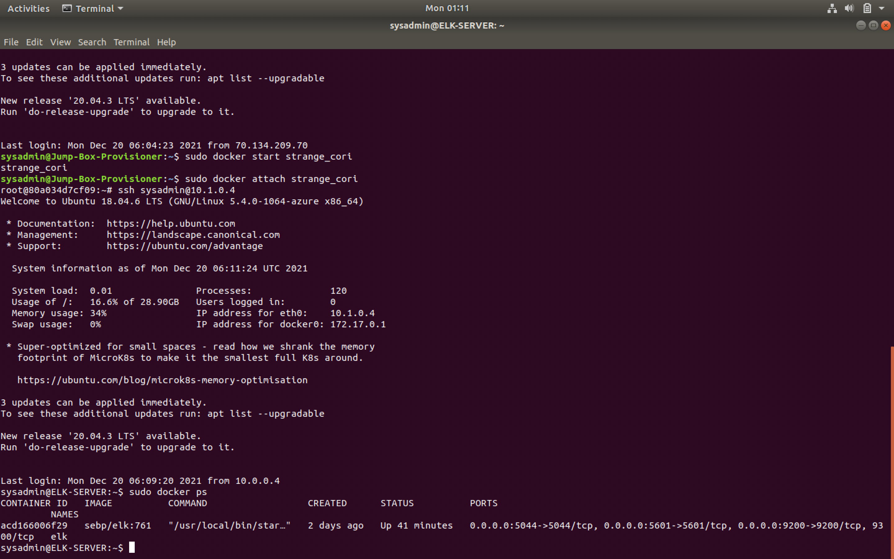

## Automated ELK Stack Deployment

The files in this repository were used to configure the network depicted below.

These files have been tested and used to generate a live ELK deployment on Azure. They can be used to either recreate the entire deployment pictured above. Alternatively, select portions of the Ansible file may be used to install only certain pieces of it, such as Filebeat.

This document contains the following details:
- Description of the Topology
- Access Policies
- ELK Configuration
  - Beats in Use
  - Machines Being Monitored
- How to Use the Ansible Build

### Description of the Topology

The main purpose of this network is to expose a load-balanced and monitored instance of DVWA, the D*mn Vulnerable Web Application.

Load balancing ensures that the application will be highly responsive, in addition to restricting traffic to the network.
- The advantage of a load balancer is the distribution of traffic across multiple servers. This effectively keeps the system from slowing as well as protects from a Ddos attack What is the advantage of a jump box?_

Integrating an ELK server allows users to easily monitor the vulnerable VMs for changes to any files and system settings.
- Filebeat monitors the specified logs and forwards them to logstash or elastisearch.
- Metricbeat monitors the metrics and statistics and ships it out to a specified output location.

The configuration details of each machine may be found below.

| Name       | Function        | IP Address | Operating System |
| ---------- | --------------- | ---------- | ---------------- |
| Jump Box   | Gateway         | 10.0.0.4   | Linux            |
| Web-1      | Virtual Machine | 10.0.0.5   | Linux            |
| Web-2      | Virtual Machine | 10.0.0.6   | Linux            |
| Web-3.     | Virtual Machine | 10.0.0.7   | Linux            |
| ELK-SERVER | Virtual Machine | 10.1.0.4   | Linux            |

### Access Policies

The machines on the internal network are not exposed to the public Internet. 

Only the ELK-SERVER machine can accept connections from the Internet. Access to this machine is only allowed from the following IP addresses:
- 10.0.0.5, 10.0.0.6

Machines within the network can only be accessed by the Jump-Box-Provisioner.

- The Jump-Box-Provisioner machine has access to the ELK-machine.

A summary of the access policies in place can be found in the table below.

| Name     | Publicly Accessible | Allowed IP Addresses            |
| -------- | ------------------- | ------------------------------- |
| Jump Box | Yes                 | Public Key i.e (20.110.147.113) |
| Web-1    | No                  | 10.0.0.5                        |
| Web-2    | No                  | 10.0.0.6                        |
| Web-3    | No                  | 10.0.0.7                        |

### Elk Configuration

Ansible was used to automate configuration of the ELK machine. No configuration was performed manually, which is advantageous because it will regularly update the files and launch the preconfigured data to an external source without need for user interaction.

This playbook implements the following tasks:
- Installs Docker 
- Installs Python
- Automatically configures the VM with Docker

The following screenshot displays the result of running `docker ps` after successfully configuring the ELK instance.

### Target Machines & Beats
This ELK server is configured to monitor the following machines:
- Web-1- 10.0.0.5    Web-2- 10.0.0.6   Web-3 10.0.0.7

We have installed the following Beats on these machines:
- Metricbeats, Filebeats

These Beats allow us to collect the following information from each machine:
- Filebeats, which monitors log files on the machines that are specified. It also sends the log data to Kibana for analysis. An example of this is the collections   of logs in extensive detail on the specified monitoring software in this example, Kibana._
- Metricbeats, which provides the metrics of the system and the servers of the specified machine. It will send the data to logstash. An example of this is the       metric data that is shown on Kibana

### Using the Playbook
In order to use the playbook:

SSH into the control node and follow the steps below:
- Copy the filebeat-playbook file to /etc/ansible/filebeat-playbook.yml.
- Update the _____ file to include...
- Run the playbook, and navigate to ____ to check that the installation worked as expected.

  Answer the following questions to fill in the blanks:_
- _Which file is the playbook? Where do you copy it?_
- _Ansible.config   How do I specify which machine to install the ELK server on versus which to install Filebeat on?_
- http://[Host I.P]:5601/app/kibana

